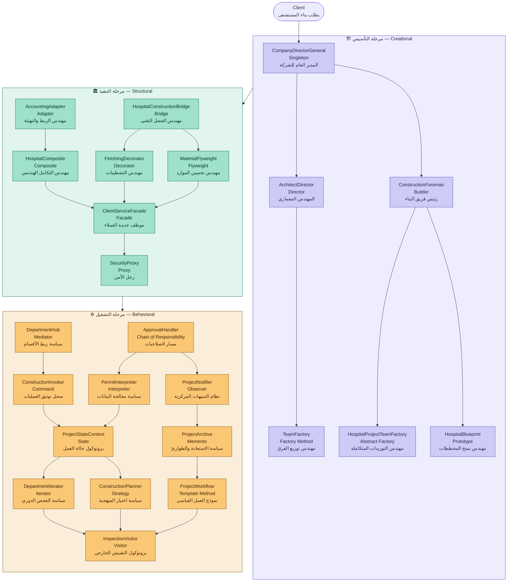

# Design Patterns — Principle Construction

> مخطط يوضح تسلسل الـ 23 نمط وعلاقاتهم ببعض عبر مراحل المشروع الثلاث.
> كل مربع يحتوي: اسم الكلاس — اسم النمط — الاسم الأدبي من قصة الشركة.

---

## ملخص العلاقات

| الاسم الأدبي | النمط | الكلاس | يعتمد على |
|---|---|---|---|
| المدير العام للشركة | `Singleton` | `CompanyDirectorGeneral` | يبدأ كل شيء |
| المهندس المعماري | `Director` | `ArchitectDirector` | `Builder` |
| رئيس فريق البناء | `Builder` | `ConstructionForeman` | `AbstractFactory` · `Prototype` |
| مهندس توزيع الفرق | `Factory Method` | `TeamFactory` | — |
| مهندس التوريدات المتكاملة | `Abstract Factory` | `HospitalProjectTeamFactory` | — |
| مهندس نسخ المخططات | `Prototype` | `HospitalBlueprint` | — |
| مهندس الربط والتهيئة | `Adapter` | `AccountingAdapter` | `Composite` |
| مهندس الفصل التقني | `Bridge` | `HospitalConstructionBridge` | `Decorator` · `Flyweight` |
| مهندس التكامل الهندسي | `Composite` | `HospitalComposite` | `Facade` |
| مهندس التشطيبات | `Decorator` | `FinishingDecorator` | `Facade` |
| مهندس تحسين الموارد | `Flyweight` | `MaterialFlyweight` | `Facade` |
| موظف خدمة العملاء | `Facade` | `ClientServiceFacade` | `Proxy` |
| رجل الأمن | `Proxy` | `SecurityProxy` | — |
| سياسة ربط الأقسام | `Mediator` | `DepartmentHub` | `Command` |
| مسار الصلاحيات | `Chain of Responsibility` | `ApprovalHandler` | `Interpreter` · `Observer` |
| سجل توثيق العمليات | `Command` | `ConstructionInvoker` | `State` |
| سياسة معالجة البيانات | `Interpreter` | `PermitInterpreter` | `State` |
| نظام التنبيهات المركزية | `Observer` | `ProjectNotifier` | `Memento` |
| بروتوكول حالة العمل | `State` | `ProjectStateContext` | `Iterator` · `Strategy` |
| سياسة الاستعادة والطوارئ | `Memento` | `ProjectArchive` | `Template Method` |
| سياسة الفحص الدوري | `Iterator` | `DepartmentIterator` | `Visitor` |
| سياسة اختيار المنهجية | `Strategy` | `ConstructionPlanner` | `Visitor` |
| نموذج العمل القياسي | `Template Method` | `ProjectWorkflow` | `Visitor` |
| بروتوكول التفتيش الخارجي | `Visitor` | `InspectionVisitor` | نهاية المشروع |

