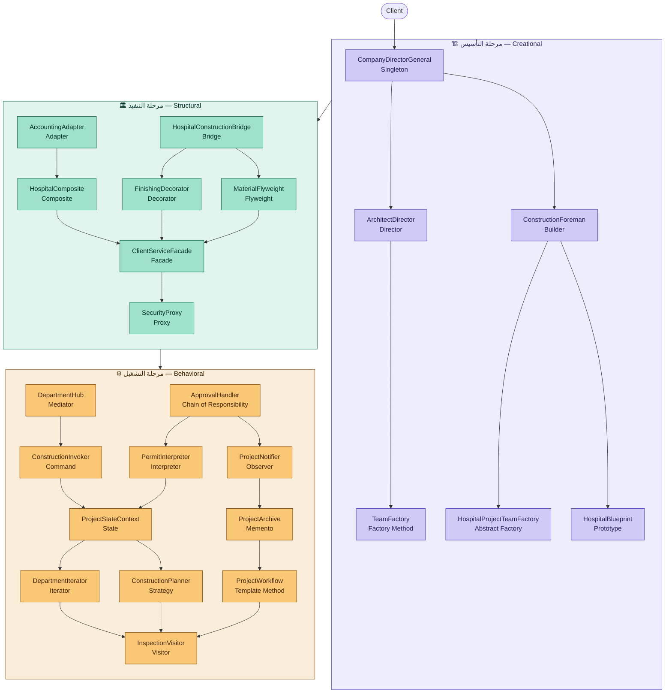

[README.md](https://github.com/user-attachments/files/29575071/README.md)

# Design Patterns — Principle Construction

> مخطط يوضح تسلسل الـ 23 نمط وعلاقاتهم ببعض عبر مراحل المشروع الثلاث.

---

## ملخص العلاقات

| النمط | يُستخدم مع / يعتمد على |
|---|---|
| `Singleton` | يبدأ كل شيء — يستدعي `Director` و `Builder` |
| `Director` | يُوجّه `Builder` خطوة بخطوة |
| `Builder` | يطلب من `Factory Method` و `Abstract Factory` و `Prototype` |
| `Adapter` | يُمرر النتيجة لـ `Composite` |
| `Bridge` | يُغذّي `Decorator` و `Flyweight` |
| `Facade` | يجمع `Composite` + `Decorator` + `Flyweight` في واجهة واحدة |
| `Proxy` | يحرس مدخل `Facade` |
| `Mediator` | يُنسّق قبل `Command` |
| `Chain` | يُقرر بعدها `Interpreter` و `Observer` |
| `Observer` | يُخطر ثم يُحفّز `Memento` |
| `State` | يفتح الطريق لـ `Iterator` و `Strategy` |
| `Visitor` | نهاية المشروع — يتلقى من `Iterator` و `Strategy` و `Template` |

